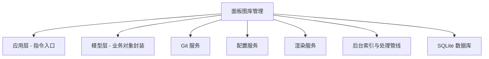
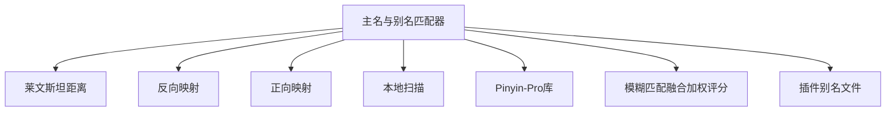

<p align="center">
  
</p>

<p align="center">
  <a href="https://github.com/Siluluna/Yunara"></a>
  <a href="https://github.com/Siluluna/Yunara"></a>
  <a href="https://github.com/Siluluna/Yunara/stargazers"></a>
  <a href="https://github.com/Siluluna/Yunara/issues"></a>
  <a href="https://github.com/Siluluna/Yunara/pulls"></a>
</p>

# 简介~ 🐶🐱🦊🐯🐷🦁🐻🐸
  **Yunara（云露插件）** 源自 **咕咕牛图库管理器** 的模块化演进,完整承载了原有的逻辑,并赋予了单文件难以企及的灵活与扩展。云露插件不强绑定 **咕咕牛图库**,你可以自由选择是否安装；同时为社区中其他图库提供了更深层次的支持。插件采用工厂日志不挂载全局反馈请携带好遇到问题的对应日志文件，
如果在使用中遇到任何困惑或问题,欢迎加入交流群反馈:<a href="https://qm.qq.com/q/cyXMqRBzY6" target="_blank" style="text-decoration: none;">
    <button style="
      padding: 10px 20px;
      font-size: 16px;
      font-weight: bold;
      color: white;
      background: linear-gradient(to right, #00aaff, #0077ff);
      border: none;
      border-radius: 8px;
      cursor: pointer;
      box-shadow: 0 2px 8px rgba(0, 0, 0, 0.1);
      transition: background 0.3s ease;
    " onmouseover="this.style.background='linear-gradient(to right, #0099dd, #0055dd)'" 
       onmouseout="this.style.background='linear-gradient(to right, #00aaff, #0077ff)'">
      💬 点击加入QQ群：原神/星铁/鸣潮/绝区零/三角洲/王者/美利坚/梅赛德斯/留学/三星交流群
    </button>
  </a>

---

## 功能列表

### 一、🖼️面板图管理
> [!NOTE]
> **Yunara** 支持多个图库模型，你可以为自己或其它图库建立适配器通过**云露**提供的底层服务『别名匹配、同步、封禁管理』获得**咕咕牛图库**相同的能力，有不理解也可以加群协助帮忙适配图库。

#### 以下是简化流程图:
<details> <summary>展开查看</summary>




</details>

#### 🥎1.咕咕牛图库：输入`#咕咕牛帮助`查看吧，点击直达 『[咕咕牛图库](https://github.com/GuGuNiu/Miao-Plugin-MBT)』

#### 🏐2.社区图库：
> [!TIP]
> 本模块使用的是通用图库逻辑，未来可能依靠Nsfwjs做前置限制级分类，基于SQLite3作为数据索引，你可以通过 `#咕咕牛登录` 进入Web后台进行管理更方便

——基础功能表——>>>
|功能|说明|
|-|-|
|#云露图库添加[仓库地址:简名]|增加一个社区图库,示例: #云露图库添加https://github.com/Siluluna/Yunara:云|
|#云露图库列表|展示安装情况/更新数据，收录了已知的全部面板图仓库地址|
|#云露图库更新[简名]|更新社区图库，不带简名则全部更新，示例: #云露图库更新云|
|#云露查看[简名][角色名]|查看指定图库的指定角色的面板图|

——封禁管理表——>>>
|功能|说明|
|-|-|
|#云露图库封/解禁[角色名+编号]|指定图片进行封禁管理，更新图库后依旧保持封/解禁，⚠️注意看末尾提示⚠️|
|#云露图库封禁列表[简名]|展示社区图库的封禁列表，不带简名则展示全部图库的数据|

>[!IMPORTANT]
> 为了避免指令过长`#云露图库封/解禁`的角色编号将会由云露统一配分避免了过长的指令，不然的话指令将会是`#云露图库封禁咕咕牛花火1`,所以建议使用**Web**端进行封禁管理。

---


## 安装插件
**Gitee 源**

```bash
git clone --depth=1 https://github.com/Siluluna/Yunara.git ./plugins/Yunara
```

**GitHub 源**

```bash
git clone --depth=1 https://github.com/Siluluna/Yunara.git ./plugins/Yunara
```

**安装依赖**

```bash
pnpm install --filter=yunara
```

## TODO-计划列表
- [ ] 基于Qwen/Banana的画图修图
- [ ] Nsfwjs鉴黄
- [ ] 群里记录管理/WEB可视化
- [ ] LLM智能体接管
      
<p align="center">
  <a href="https://github.com/Siluluna/Yunara/">
    
  </a>
</p>


